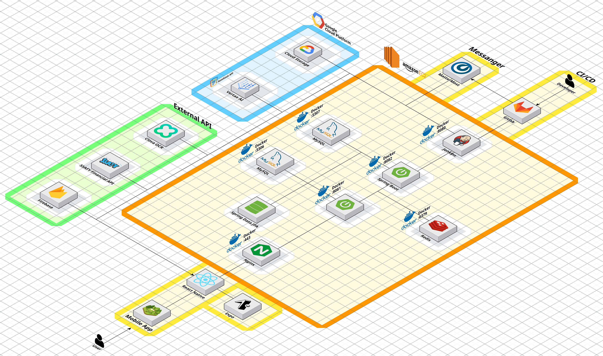

- ### README

  # 🌴 코코의 숲 (Coco’s Forest)

   
   
   ## 탄소 절약 챌린지 × 금융 소비 분석 × 게임화
   
   > 코코의 숲은 금융 소비 내역을 기반으로 탄소 배출량을 환산하고, 챌린지와 게임적 요소를 통해 즐겁게 환경 보호를 실천할 수 있는 서비스입니다.
   > 
   > 
   > 소비 내역 → 탄소 발자국 → 챌린지 → 포인트 → 숲 성장으로 이어지는 선순환 구조를 통해, 사용자가 꾸준히 환경 보호 습관을 만들 수 있도록 돕습니다.
   > 
   - **개발 기간** : 2025.08.25 ~ 2025.09.29
   - **플랫폼** : Mobile (React Native), Android SDK 기반 네이티브 앱
   - **개발 인원** : 6명
   
   ---
   
   ## 👥 팀원

| 이름          | 포지션             | 주요 역할                                                                                                                                        |
| ------------- | ------------------ | ------------------------------------------------------------------------------------------------------------------------------------------------ |
| 김태윤 (팀장) | 백엔드             | 전반적인 백엔드 총괄, 금융 API 연동, 챌린지 시스템, OCR 구현, 프론트 최적화                                                                      |
| 권인          | 프론트엔드         | 대시보드 및 탄소 달력 구현, 화면 디자인, 영상 포트폴리오 제작, 코코 GIF 제작                                                                     |
| 김민주        | 프론트엔드         | 로그인/회원가입 구현, 챌린지·랭킹 화면 구현, WearOS 연동                                                                                         |
| 박민수        | 인프라/DevOps      | Docker·Jenkins 파이프라인 구축, 시크릿/환경변수 관리, Nginx 리버스 프록시 및 SSL, 보안 설정(헤더, 레이트 리밋, 헬스체크), GCP AI 파이프라인 구축 |
| 정원준        | 백엔드             | 홈화면 아이소메트릭 큐브 구현, 숲 관련 DB 및 API 설계, FCM 알림 서비스                                                                           |
| 박진주        | 디자인/프론트 지원 | 코코 디자인 및 아트 에셋 제작, 챌린지 API 연동, SSAFY 금융 API 연동 지원                                                                         |

---

---

## 🧰 기술 스택

<!-- Core -->

 

<!-- Frontend -->

 

<!-- DevOps / Cloud -->

 

### 백엔드

- **언어**: Java 17
- **프레임워크**: Spring Boot 3.x
- **데이터베이스**: MySQL 8.0.x (InnoDB, utf8mb4)
- **ORM**: JPA (Spring Data JPA)
- **캐싱**: Redis 7.x (세션 관리 및 챌린지 캐싱)
- **실시간 통신**: FCM (Firebase Cloud Messaging) 알림 서비스
- **서버**: Nginx (Reverse Proxy, SSL 인증서 적용)
- **배포/CI/CD**: Docker, Jenkins, GitLab
- **클라우드**: AWS EC2, Google Cloud Platform (Vertex AI 일부 연동)
- **외부 API**: SSAFY 금융망 API (계좌/카드 내역, 카테고리), Clova OCR (영수증 인증)

### 프론트엔드

- **언어**: React Native (Android), JavaScript
- **프레임워크**: Android SDK (Native)
- **상태 관리**: React Hooks, Context API
- **UI/스타일링**: XML Layout, Figma 디자인 반영
- **차트/통계**: Custom Canvas 기반 달력 & 탄소 절감 리포트
- **게임화 요소**: 2D 아이소메트릭 큐브 맵, 코코 캐릭터 랜더링
- **API 연동**: Retrofit (Android), Axios (React Native)
- **Wearable**: WearOS 연동 (걸음수 기반 챌린지)

---

## ✨ 주요 기능

### 🏡 홈 (숲 꾸미기)

- 2D **아이소메트릭 큐브 맵** 기반의 숲 구현
- 포인트를 활용해 **나무(사과/벚꽃/오렌지)** 및 **장식(횃불 등)** 설치
- 숲 확장 기능: 일정 조건 달성 시 새로운 땅 개방
- 나무 HP 시스템: 물주기·탄소 절약 성공 시 회복, 미참여 시 시듦 → 고사 단계
- 실시간 피드백(토스트/메시지)으로 사용자 행동과 숲 상태 연결  
  

---

### 📊 대시보드 (탄소 리포트)

- 월별/주별/일별 **탄소 배출량 통계** 제공
- **탄소 달력**: 하루 단위 절약/초과 여부를 달력 형태로 시각화
- 소비 카테고리별 배출 비율 및 감축 현황 비교
- **Vertex AI 분석**: 사용자의 소비 패턴을 학습 → “이번 달 교통 소비가 줄었어요!” 같은 코코 말풍선 피드백  
  

---

### 🏆 챌린지

- **OCR 영수증 인증**: Clova OCR로 텀블러 사용, 친환경 소비 인증
- **금융 연동 챌린지**: SSAFY 금융망 API 기반 계좌/카드 내역 → 탄소 배출량 자동 환산
- 걸음 수 / 출석 / 소비 절약 등 다양한 일일 챌린지
- 성공 시 포인트 적립 → 숲 꾸미기/물주기에 사용
- 실패 시 숲 HP 감소로 사용자 행동에 직접적인 피드백 반영
   
   &nbsp;&nbsp;&nbsp;
  

---

### 👤 마이페이지

- **회원 정보 관리**: 로그인/회원가입, 프로필 수정
- 개인별 **누적 포인트·탄소 감축 기록** 확인
- **챌린지 참여 내역** 및 성공/실패 히스토리 제공
- WearOS 연동 기록: 걸음 수 → 탄소 절약 지표 반영
- 

---

## 🏗 시스템 아키텍처

- **CI/CD**: Jenkins를 활용해 자동화된 빌드 및 배포 파이프라인 구축
- **협업 알림**: Merge Request 생성 및 배포 빌드 시 Mattermost로 실시간 알림 전송
- **배포 환경 분리**: 테스트 서버(Dev)와 운영 서버(Prod)를 분리하여 안정적인 배포 및 운영 환경 보장
- **보안 및 가용성 강화**:
  - Nginx Reverse Proxy + SSL 인증서 적용
  - Docker 기반 컨테이너화로 일관된 실행 환경 확보
  - Redis 세션 캐싱을 통해 인증 및 챌린지 처리 성능 최적화
- 
